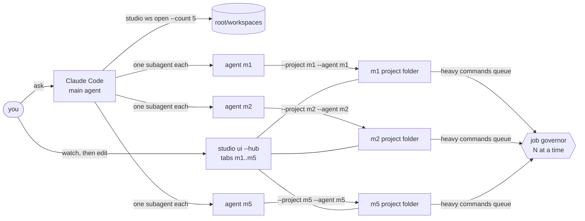

# Parallel workspaces

Up to **five media workspaces** (image, video, audio: slots `m1`..`m5`) and **five design workspaces** (design and animation: slots `d1`..`d5`) can be open and worked on by agents **at the same time**, one agent or subagent per workspace. The person watches in the editor and takes over a workspace when its agent has finished.

Three rules, enforced by the software and not by good manners:

1. **At most five per editor.** A sixth is refused with the list of what is in use.
2. **One agent per workspace; the person waits.** While an agent holds a workspace, its editor is view-only. The editor opens again, by itself, when the agent ends or goes quiet.
3. **Media is added by the agent.** There is no import, upload, file picker or drop target in either editor, and the servers refuse requests that would add media.

## What a workspace is

An ordinary Studio project folder under `<root>/workspaces/<slot>/`: its own `project.studio.json` (or `design.studio.json`), ops log, `assets/`, `renders/`, cache and lock. Nothing is shared between workspaces, so there is nothing for two agents to corrupt. Every `studio` command already works on one folder through `--project`; a workspace is that folder plus a slot name and a lease.

Slots are fixed names created with an atomic `mkdir`. That is the whole limit: of any number of processes asking at once, the free slots are granted exactly once each (tested with 8 processes racing for 5). A slot whose creator died before finishing is reused after two minutes if it is empty; one with files in it is never taken over.

Closing (`studio ws close m2`) moves the folder to `workspaces/.closed/m2-<time>/`. Nothing is deleted; the project, assets and renders are all in it.

## Commands

| Command | What it does |
|---|---|
| `studio ws open [--kind media\|design] [--count N] [--name T] [--slot m3] [--root DIR]` | Open 1 to 5 workspaces at once, all or nothing. `--width --height --fps --background` (and `--duration` for design) set the canvas. Prints each workspace's folder and the exact flags to use with it. |
| `studio ws list [--kind K]` | Slots in use and free, each workspace's state (idle, agent working, which agent, its note), clip or layer count. Works from inside a workspace folder. |
| `studio ws close <slot> [--force]` | Free a slot. Refused while an agent holds it, unless `--force`. |
| `studio work begin --agent NAME [--note T] [--ttl S]` | Take this workspace: the editor becomes view-only for the person. Another live agent holding it refuses. |
| `studio work end --agent NAME` | Give it back at once. Always do this when finished, also after a failure. |
| `studio work status` | Who holds it and for how many more seconds. |
| `studio ui --hub [--root DIR]` | The media editor with a tab for each of `m1..m5`. |
| `studio design ui --hub [--root DIR]` | The design editor with a tab for each of `d1..d5`. |

Every command takes `--agent NAME` (MCP: the `agent` argument; `project` names the workspace folder). A write that carries it takes the workspace by itself, so `work begin` is only needed to set a note or a longer wait. Tools for all of this exist over MCP as `studio_ws_open`, `studio_ws_list`, `studio_ws_close`, `studio_work_begin`, `studio_work_end`, `studio_work_status`.

Exit code 5 covers `WORKSPACE_LIMIT` (all slots in use), `WORKSPACE_BUSY` (another agent holds the workspace) and `AGENT_WORKING` (a person's edit while an agent holds it).

## The lease

A small file, `.studio/agent.json`: agent name, optional note, start, expiry. It means "an agent is working here".

* **Renewed by activity.** Every write the agent makes renews it, and a command that runs long (a render) renews it every 10 s while it runs. Default expiry 120 s after the last activity (`--ttl 1..3600`).
* **Ends by itself.** A crashed or forgotten agent never locks a person out for more than the expiry; `work end` is the polite way and frees the editor at once.
* **Holds off the other agent.** A write that names a different agent while the lease is live is refused with `WORKSPACE_BUSY` and writes nothing. That is the guard against a subagent wandering into a sibling's folder. A write that names no agent is allowed (it cannot be told apart from the holder) and renews the lease.
* **Holds off the person in the store, not only in the page.** `ProjectStore` and `DesignStore` refuse an edit with actor `ui` (apply, undo, redo) while a lease is live, so the guard holds whichever door the edit comes through. The agent is never refused by this.

## What the person sees

* **Tabs.** `studio ui --hub` and `studio design ui --hub` show one tab per workspace: slot, name, and a dot that pulses while an agent is working in it. A hub opened without `?ws=` goes to the first workspace; with none open it says how to open them.
* **View-only while an agent works.** A pill at the top says which agent and what it is doing. Undo, redo, export, the drawing tools and the inspector are off; the person can still select, scrub, play, zoom and pan. The agent's edits appear live as they are made. The server answers any edit with `423 AGENT_WORKING` and writes nothing.
* **Editable when it finishes.** The pill disappears when the lease ends. Nothing needs reloading.
* **No import of media.** No file picker, no Image or Audio tool in the design editor, no import in the media editor. A file dropped on the page is not opened by the browser; the page says media is added by the agent. A request that would add media is refused (`403 AGENT_ONLY`): the upload endpoint, `asset.*` ops, image or audio layers, and a new `src`. The agent adds media with `studio ingest` and `studio design asset` + `studio design add`.
* **A closed workspace** disappears from every open tab strip, and the page that was open on it says it was closed.

## The job governor

Heavy commands (render, export, stills, denoise, upscale, transcription, colour analysis, QC, ...) take one of N machine-wide job slots before they start, and give it back when they finish. N is `STUDIO_MAX_JOBS`, else half the cores, at most 3 (2 on a 4-core machine). A slot is a file created exclusively in a shared folder (`STUDIO_JOBS_DIR`, default under the temp folder); a slot whose process is gone is taken over, so a killed render never blocks the machine. A heavy command that runs another heavy command (a colour analysis renders a frame) counts as one job. The design editor's own export takes a slot too. Frame previews do not: they are one frame at a time and must stay quick.

Why: five agents starting five renders at once starts five browsers and five encoders. Measured on this machine (4 cores, 16 GB), five 1280x720 design exports to MP4:

| Limit | Wall time | Peak memory (sum of resident sizes of Studio and Chromium processes) |
|---|---|---|
| none (5 at once) | 11.2 s | 5.6 GB |
| 2 (the default here) | 16.5 s | 2.5 GB |
| 1 | 24.3 s | 1.4 GB |

So the default costs about 45% more wall time for this batch and uses 56% less memory. Summed resident sizes count shared pages more than once, so they overstate the real figure; the ratio between rows is what matters. On a machine with less memory the first row is the one that gets killed.

## For the agent

`.claude/skills/studio-media/rules/15-parallel-workspaces.md` is the protocol: open the workspaces, give each subagent one folder and one name, have every command carry `--project` and `--agent`, `work end` when done, verify each result, report what was and was not checked.

## Evidence

`tests/workspaces.test.ts` (15 tests, no browser) and `tests/workspaces-ui.test.ts` (12 tests, real Chromium):

* Five per editor, independent for media and design; a sixth is refused naming what is in use; 8 processes racing get exactly 5 slots; a batch is all or nothing and leaks nothing; an abandoned empty claim is reused and a folder with files is not; close archives, refuses while held; `ws list` works from inside a workspace.
* Leases: another agent refused and nothing written; owner and unnamed writes pass and renew; auto-lease on a named write; expiry; ended twice is harmless; the stores refuse actor `ui` for apply, undo and redo in both editors and never the agent.
* Parallel: five media workspaces ingest, edit and render at once at a limit of 2: each output has its own length and its own picture, 2 heavy commands ran at once at most and exactly 2 at the peak, every slot handed back (2.5 s wall for clips of 2 to 6 s at 640x360). Five designs export at once: each has its own pixels (3.4 s). Control: without a limit all five ran at once.
* Governor: waits while a live process holds the only slot and goes on when released; takes over a dead holder's slot; a heavy command that runs another does not wait for itself with one slot.
* Browser: tabs per workspace and switching; an agent's work shows on its tab live; the page is view-only (disabled controls, drag, nudge, delete, undo, duplicate and draw all write nothing), the server answers 423, the agent's edits still appear live, and it is editable again at the end; a page opened mid-lease hears the end even when it happens before the server's next look; no file picker, no Image or Audio tool or shortcut, a dropped file is turned away, media is refused by the server and the agent's image does appear; a closed workspace; a hub with nothing open.

Bugs found by these tests and fixed: the server compared the lease with one remembered value, so a page that connected mid-lease could miss its end (now remembered per page; a regression test fails on the old logic); an estimate in `image upscale` divided by zero on tiny images; number boxes could lose typed text to a late refresh (0 failures in 80 under load after, 3 in 40 before; 1 in 60 before my changes too); Ctrl+Z pressed before the server had answered the edit was ignored.

## Not verified, and limits

* **One real Claude Code session driving five subagents has not been run.** The tests drive the same commands from five concurrent processes; the subagent protocol is written down in the skill, not exercised by a model here.
* **Each workspace is one person's editor at a time.** Two browser windows on the same workspace both work (edits are serialized and a stale one is refused with 409), but there is no cursor or presence for the second person.
* **The governor limits Studio's commands and servers.** It cannot limit a program someone starts by hand, and a request is not queued fairly: waiting commands retry at random, so order is not guaranteed.
* **Frame previews are not governed**; five open media workspaces can each be rendering one frame.
* **`ws close` keeps everything**, so closed folders accumulate under `workspaces/.closed/` until deleted by hand.
* **Lease timing is a clock on one machine.** The expiry uses the machine's clock; the editors do not run on another machine.
* Touch input, other browsers than Chromium, and screen-reader use of the tab strip were not tested.
